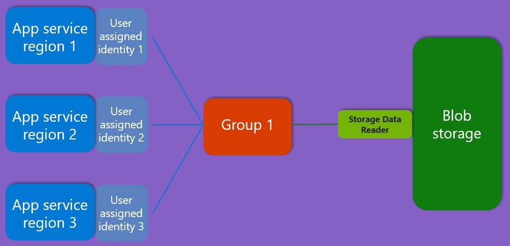

# Enable client services to read from Blob storage, using a Microsoft Entra security group

This video shows how the Bicep file is created, deployed and then run to demonstrate an app service reading from the Blob Storage account.

[](../../docs/media/app-service-to-blob-service-using-a-security-group.mp4)

## Details

This Bicep template configures three regional user-assigned managed identities, that can be used to read from a Blob Storage account, via a security group. The user-assigned managed identities are added as members of the security group, and the security group is assigned an Azure Reader role to the Blob Storage account. You can find other Azure built-in roles [here](https://learn.microsoft.com/en-us/azure/role-based-access-control/built-in-roles).

### Prerequisites

* Ownership of a GitHub repo.
* Have a valid **Azure subscription**: If you don't own an Azure subscription, [create a free account](https://azure.microsoft.com/free/) before you begin.
* [Bicep tools for authoring and deployment](https://learn.microsoft.com/graph/templates/quickstart-install-bicep-tools). The minimum required Bicep version is v0.30.3.
* Have a **Microsoft Entra role** that assigns you permissions to create security groups. [Users have this permission by default](https://learn.microsoft.com/entra/fundamentals/users-default-permissions#compare-member-and-guest-default-permissions). However, [admins can turn off this default](https://learn.microsoft.com/entra/fundamentals/users-default-permissions#restrict-member-users-default-permissions) in which case you need to be assigned at least the [Groups Administrator](https://learn.microsoft.com/entra/identity/role-based-access-control/permissions-reference#groups-administrator) role.

### Deploy the Bicep template

You can deploy the template with the following Azure CLI command (replace `<resource-group>` with the name of your resource group):

```sh
az deployment group create --resource-group <resource-group> --template-file main.bicep
```

To deploy the same template using Az Powershell, use:

```powershell
New-AzResourceGroupDeployment -ResourceGroupName <resource-group> -TemplateFile .\main.bicep
```
